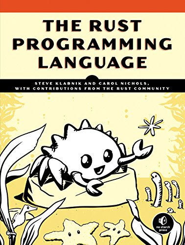
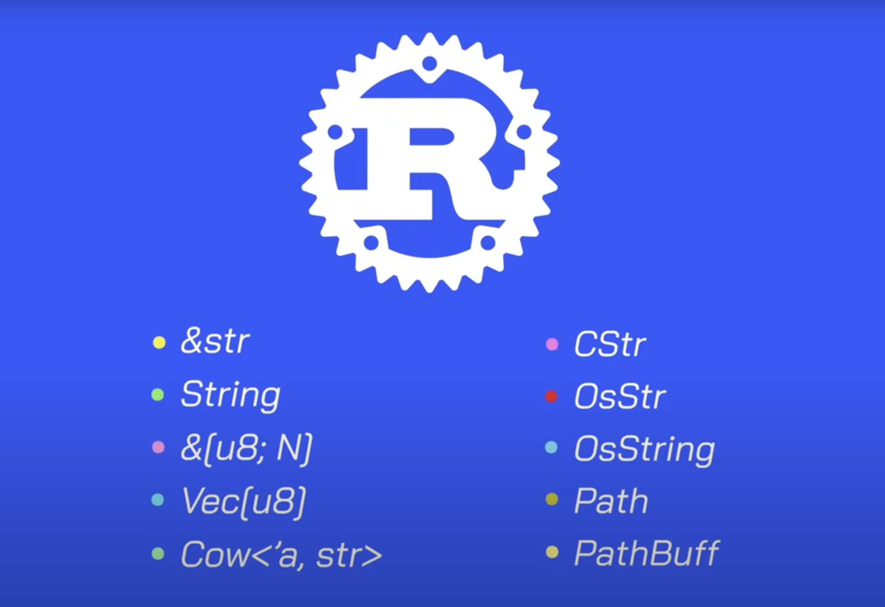

layout: true

.signature[@algogrit]

---

class: center, middle

# Rust Fundamentals

Gaurav Agarwal

---
class: center, middle



.content-credits[https://doc.rust-lang.org/book/title-page.html]

---

class: center, middle

Rust is a compiled language. Every program needs to be compiled before it can be run!

---

Looking at `scratchpad`

---

## Running & Building

- `rustc`

  - For compiling, a `.rs` to a binary

- `cargo`

  - For managing, rust projects.
    - `cargo build` for compiling
    - `cargo run` for compiling and running (during development)
    - `cargo test` for testing
    - ...

---

class: center, middle

## Naming Conventions

---

- functions, variables (let), modules & filenames, methods

  `snake_case`

- constants

  `SCREAMING_SNAKE_CASE`

- Enums, Structs, Traits

  `PascalCase` or `UpperCamelCase`

---
class: center, middle

## Variables & Types

---
class: center, middle

### Variables

---

- Immutable by default
- `mut` keyword for mutability
- Strongly typed
- Type can be inferred
- Allows shadowing!
- Types classification:
  - Scalar
  - Compound

---
class: center, middle

#### Scalar

integers, floats, boolean, character

---

##### Integers

- `i8` to `i128`;
- `u8` to `u128`
- `isize` & `usize` (`arch` dependent)
- Can use `_` as decimal separator
- Rust defaults to `i32`

---

##### Floats

- `f32` & `f64`
  - `f64` is default
- `IEEE-754` standard

---

##### Boolean

- `bool`

---

##### Character

- `char`
  - four bytes in size and represents a Unicode Scalar Value
- a "character" isn’t really a concept in Unicode, so your human intuition for what a “character” is may not match up with what a char is in Rust

---
class: center, middle

#### Compound

tuple, array

---
class: center, middle

Compound types can group multiple values into one type.

---

##### Tuple Type

- A tuple is a general way of grouping together a number of values with a variety of types into one compound type.
- Tuples have a fixed length: once declared, they cannot grow or shrink in size.

- Eg:

```rust
let tup: (i32, f64, u8) = (500, 6.4, 1);
```

---

- To get the individual values out of a tuple, we can use pattern matching to destructure a tuple value

```rust
let (x, y, z) = tup;
```

---

- In addition to destructuring through pattern matching, we can access a tuple element directly by using a period (.) followed by the index of the value we want to access.

```rust
let six_point_four = x.1;
```

- As with most programming languages, the first index in a tuple is 0.

---

##### Array Type

- Every element of an array must have the same type.
- arrays in Rust have a fixed length

- Eg:

```rust
let a = [1, 2, 3, 4, 5];
```

---

- Arrays are useful when you want your data allocated on the stack rather than the heap

- A vector is a similar collection type provided by the standard library that is allowed to grow or shrink in size.

---

- Eg:

```rust
let a: [i32; 5] = [1, 2, 3, 4, 5];
```

- you can specify the initial value, followed by a semicolon, and then the length of the array in square brackets

```rust
let a = [3; 5];
```

The array named a will contain 5 elements that will all be set to the value 3 initially.

---
class: center, middle

### Type Conversion using `as`

---
class: center, middle

### Parsing strings using `.parse`

---
class: center, middle

What happens if you try to access an element of an array that is past the end of the array?

---
class: center, middle

### Constants

---

- declared using the `const` keyword
- constants cannot be shadowed!

---
class: center, middle

## Functions

---

### Passing arguments

```rust
fn main() {
  add(10, 20);
}

fn add(x: i32, y: i32) {
  println!("{}", x + y);
}
```

---

### Returning values

```rust
fn five() -> i32 {
  return 5
}
```

- `return` is optional

---
class: center, middle

## Control Flow

---

### `if`

- Similar to `if ... else` in many other languages
- Can be used for assignment

---
class: center, middle

### Repetition with loops

---
class: center, middle

Rust has three kinds of loops: `loop`, `while`, and `for`.

---

#### `loop`

- You can `loop` forever in rust
- Control execution using `break` & `continue`
- Usually used as a retry mechanism
- Also useful for assignment as well

---

#### `while`

- Normal

---

#### `for`

- Can only be used as `for <el> in <iter>` format

---
class: center, middle

## Ownership

---
class: center, middle

Ownership is Rust’s most unique feature, and it enables Rust to make memory safety guarantees without needing a garbage collector.

---
class: center, middle

All programs have to manage the way they use a computer’s memory while running. Some languages have garbage collection that constantly looks for no longer used memory as the program runs; in other languages, the programmer must explicitly allocate and free the memory.

---
class: center, middle

Rust uses a third approach: memory is managed through a system of ownership with a set of rules that the compiler checks at compile time. None of the ownership features slow down your program while it’s running.

---
class: center, middle

### What happens when you assign values and pass them around?

---
class: center, middle

### Stack vs Heap

---

#### Stack

- All data stored on the stack must have a known, fixed size.

#### Heap

- Data with an unknown size at compile time or a size that might change must be stored on the heap instead.

---

- Pushing to the stack is faster than allocating on the heap because the allocator never has to search for a place to store new data

- Accessing data in the heap is slower than accessing data on the stack because you have to follow a pointer to get there.

---
class: center, middle

Keeping track of what parts of code are using what data on the heap, minimizing the amount of duplicate data on the heap, and cleaning up unused data on the heap so you don’t run out of space are all problems that ownership addresses.

---
class: center, middle

### So, what happens when you assign values and pass them around?

---

- All primitive types (and types allocated on stack) implement a `Copy` trait
- If a type implements the `Copy` trait, an older variable is still usable after assignment

---
class: center, middle

#### We will discuss traits later...

---
class: center, middle

#### ... let's take a look at `std::string::String`

---

In order to support a mutable, growable piece of data, we need to allocate an amount of memory on the heap, unknown at compile time, to hold the contents:

- The memory must be requested from the memory allocator at runtime.

- We need a way of returning this memory to the allocator when we’re done using it

---

- `String` is allocated over the Heap
- It has a slightly different behavior when:
  - assigned
  - passed to or returned from a function

---

### Ownership Rules (applies to all variables)

- Each value in Rust has a variable that’s called its owner.
- There can only be one owner at a time.
- When the owner goes out of scope, the value will be dropped.

---
class: center, middle

Sometimes you do want to share data with other functions

---
class: center, middle

### Borrowing

---
class: center, middle

Borrowing doesn't transfer ownership!

---
class: center, middle

#### Using references

---

- Using `&` and `*`
  - looks similar to pointers in other languages
- Note: In rust, the type info contains `&` instead of `*`

---
class: center, middle

References can be mutable too!

---

- Like variables, references aren't mutable by default
- You can use the `mut` keyword to create mutable references
- Cannot mix immutable variables with mutable references

---
class: center, middle

Mutable references have one big restriction: you can have only one mutable reference to a particular piece of data in a particular scope.

---

This prevents data races.

- Two or more pointers access the same data at the same time.
- At least one of the pointers is being used to write to the data.
- There’s no mechanism being used to synchronize access to the data.

Users of an immutable reference don’t expect the values to suddenly change out from under them!

---

##### Rules of References

- At any given time, you can have either one mutable reference or any number of immutable references.
- References must always be valid.

---
class: center, middle

#### Using slices

---
class: center, middle

Slices let you reference a contiguous sequence of elements in a collection rather than the whole collection.

---

Eg. `[start_index..end_index]`

---

Some of the common problems avoided by Rust's ownership and borrowing:

- Double free (Transferring)
- Dangling Pointers (Borrowing)
- Data Races (Single Mutable References)
- Index out of bound (slices)

---
class: center, middle

## Compound Data Type: `struct`

---
class: center, middle

Created using `struct` keyword

---

- Like ruby, if variable name and field names are same, the field name can be avoided during initialization
- Use `struct update syntax`, to create a new struct using some fields of old struct
- Structs can also be tuples
- You can also create unit structs

---
class: center, middle

### Ownership of Struct Data

---
class: center, middle

### Debugging & Printing structs

---

- Printing requires implementing `Display` trait
- Using the `Debug` trait, and deriving it:

```rust
#[derive(Debug)]
```

---

- Can print using, `{:?}`

- Or use: `{:#?}` for pretty printing

---

### Methods for `struct`

- Defined using the `impl` block

- Should take `self` or `&self` reference as first arg

- Methods can take more than one arg

---

### Associated functions

- `impl` blocks can define other associated functions as well

- Eg. `String::from`

- Typical usage is for creating constructors (`new` is the convention)

---
class: center, middle

You can define multiple `impl` blocks

---
class: center, middle

### Tuple Structs

---
class: center, middle

### Unit Structs

---
class: center, middle

## Enums

---
class: center, middle

Similar to algebraic data types in ML family of languages

---

- Defined using `enum` keyword

Eg:

```rust
enum Action {
  Jump(i32)
  Stop
  Turn(Direction)
  Walk
}
```

- Methods can be defined on `enums` as well, similar to `struct` using `impl`

---
class: center, middle

### Pattern matching

---

- Use `match`

- `match` is exhaustive

- You can use `_` (underscore), as a catch all "match arm"

- You can use `()` as a do nothing, `noop`!

---

- `if let` is a more concise way to perform the same things as above!

- can also have `else` & `else if let` blocks

---
class: center, middle

### Common Enums

---
class: center, middle

#### `Option<T>` (`std::option::Option`)

---

- Two variants: `Some<T>` and `None`

- Rust also doesn't have `nil` or `null`!

- Instead it relies on the `Option` enum in the standard library

---
class: center, middle

#### Result<T, Err>

---
class: center, middle

## Project Management

---

Rust has a number of features that allow you to manage your code’s organization, including which details are exposed, which details are private, and what names are in each scope in your programs.

These features, sometimes collectively referred to as the module system, include:

- Packages: A Cargo feature that lets you build, test, and share crates
- Crates: A tree of modules that produces a library or executable
- Modules and `use`: Let you control the organization, scope, and privacy of paths
- Paths: A way of naming an item, such as a `struct`, function, or module

---
class: center, middle

### Packages / Crates

---

- A package can have multiple binary crates by placing files in the src/bin directory: each file will be a separate binary crate.

- A crate will group related functionality together in a scope so the functionality is easy to share between multiple projects.

- If a package contains src/main.rs and src/lib.rs, it has two crates: a library and a binary, both with the same name as the package.

---

- Binary Packages: `src/main.rs`

- Library Packages: `src/lib.rs`

---
class: center, middle

### Modules

---
class: center, middle

Modules let us organize code within a crate into groups for readability and easy reuse. Modules also control the privacy of items, which is whether an item can be used by outside code (public) or is an internal implementation detail and not available for outside use (private).

Related keywords: `mod`, `pub`, `use`, `as`

---

- `mod`: used to define a module

  - Alternatively, can create a file with same name or `dir/mod.rs` file

- `pub`: Used to make modules & selected functionality public.

  - Related: `in`

---

- `use`: For importing a path to the current module

  - Related: `crate`, `super`, `self`, `extern`
  - Also has a multi-import syntax as well

- `as`: Is used to aliasing an import

---
class: center, middle

### Customizing builds with release profiles

---

Cargo has two main profiles:

- "dev" profile Cargo uses when you run `cargo build`
- "release" profile Cargo uses when you run `cargo build --release`

The dev profile is defined with good defaults for development, and the release profile has good defaults for release builds.

---

The opt-level setting controls the number of optimizations Rust will apply to your code, with a range of 0 to 3.

```toml
[profile.dev]
opt-level = 0

[profile.release]
opt-level = 3
```

---
class: center, middle

### Workspaces

---

Created manually!

```bash
cat Cargo.toml
```

```toml
[workspace]

members = [
    "<crate names>",
]
```

---
class: center, middle

## Collections in std library

---

- Have different behavior cause of Heap allocations

- A rust programmer will need to understand ownership better before writing any meaningful applications

---

Rust’s collections (`std::collections`) can be grouped into four major categories:

- Sequences: `Vec`, `VecDeque`, `LinkedList`
- Maps: `HashMap`, `BTreeMap`
- Sets: `HashSet`, `BTreeSet`
- Misc: `BinaryHeap`

.content-credits[https://doc.rust-lang.org/std/collections/index.html]

---

We’ll discuss three collections that are used very often in Rust programs:

- A vector allows you to store a variable number of values next to each other.
- A string is a collection of characters. We’ve mentioned the String type previously.
- A hash map allows you to associate a value with a particular key. It’s a particular implementation of the more general data structure called a map.

---
class: center, middle

### Vectors

---

A contiguous growable array type, written as `Vec<T>` and pronounced ‘vector’.

- Creating a vector:
  - `Vec::new()`
  - `vec!()` macro

- Updating a vector:
  - `v.push(5)`

- Dropping a Vector Drops Its Elements

- Reading Elements of Vectors
  - Indexing: `v[n]`
  - get method: `v.get(n)`

- Iterating over the Values in a Vector
  - `for _ in _`

- Using an Enum to Store Multiple Types

---
class: center, middle

`get` vs `get_mut`

---
class: center, middle

### String

`String` is a wrapper over a `Vec<u8>`.<sup>`*`</sup>

---
class: center, middle

Trying with “नमस्ते” or "Здравствуйте"!

---
class: center, middle

Slicing Strings: What are we slicing exactly?

---
class: center, middle

bytes!

---
class: center, middle

Iterating Over Strings

---
class: center, middle

<sup>`*`</sup> There are many other string types in rust!



.content-credits[https://www.youtube.com/watch?v=CpvzeyzgQdw]

---
class: center, middle

### HashMap

---

- `use std::collections::HashMap;`

- `HashMap::new();`

- Inserting into the HashMap
  - `insert` method

- Another way of constructing a hash map is by using iterators and the collect method on a vector of tuples, where each tuple consists of a key and its value.

- Accessing Values in a Hash Map
  - `get` method

- Updating a Hash Map
  - Overwriting a Value: `insert` methods
  - Inserting if there is no value: `entry` & `or_insert` methods
  - Updating values via mutable references

---
class: center, middle

#### Hash Maps and Ownership

---
class: center, middle

For types that implement the `Copy` trait, like `i32`, the values are copied into the hash map. For owned values like `String`, the values will be moved and the hash map will be the owner of those values.

---
class: center, middle

### Hashing Functions

HashMap uses a hashing function called SipHash that can provide resistance to Denial of Service (DoS) attacks involving hash tables.

.content-credits[https://en.wikipedia.org/wiki/SipHash]

---
class: center, middle

## Errors & panics

---

Two options in Rust:

- `panic!`
  - No recovery

- `Result<T, E>`
  - Variants: `Ok(T)`, `Err(E)`

---
class: center, middle

### Panic

---
class: center, middle

Can get backtrace using: `RUST_BACKTRACE=1` env variable.

---

#### Turn off [unwinding](https://doc.rust-lang.org/nomicon/unwinding.html)

```toml
[profile.release]
panic = 'abort'
```

---
class: center, middle

### Result<T, E>

---

Use `match`

- match on different errors using `kind` method

---

Use methods like

- `unwrap_or_else` <- allows err handling
- `unwrap` <- panic
- `expect` <- panic with custom message

---

Propagating errors

- `?` <- can return even from main
- Return type: `Result<(), Box<dyn Error>>`

---
class: center, middle

## Generics

---
class: center, middle

Generics are used for static dispatching.

---

You can define generic:

- Functions

- Struct

- Enums

- Methods

---
class: center, middle

Compiler does "Monomorphization"!

---
class: center, middle

Generics have zero-cost.

---
class: center, middle

## Traits

---

Allow us to define constraints on generic features.

- Defined using `trait` keyword

- Can contain default method definitions too!

---
class: center, middle

### Coherence (Orphan Rule)

---
class: center, middle

Trait can be implemented by structs in different modules too!

---

You can either

- implement a trait from same module for an external type

- implement an external trait for type from same module

---
class: center, middle

### From / Into traits

.content-credits[https://doc.rust-lang.org/rust-by-example/conversion/from_into.html]

---
class: center, middle

### Marker traits

.content-credits[https://doc.rust-lang.org/stable/std/marker/]

---
class: center, middle

### Advanced Traits

---

- Traits can be used as restrictions for params using `impl`
  - This is a syntactic sugar

- Can specify multiple trait bounds using `+`

- `where` clause, an alternative to improve readability

- Using trait bounds you can also have a "selective" generic implementation

---
class: center, middle

#### Trait Objects

---
class: center, middle

Trait Objects allow dynamic dispatching or runtime polymorphism.

---
class: center, middle

A Trait Object usually takes the form: `Box<dyn {trait-name}>`

---
class: center, middle

##### Object Safety Is Required for Trait Objects

You can only make object-safe traits into trait objects.

---

A trait is object safe if all the methods defined in the trait have the following properties:

- The return type isn’t `Self`.

- There are no generic type parameters.

---
class: center, middle

## Lifetimes

---

Rust doesn't come with a GC.

- The compiler does come with a "Borrow Checker".

- Some code possible in other languages isn't possible in Rust

- The compiler needs to ensure that there aren't any dangling pointers in your code.

- It does it by keeping track of the lifetime of each variable & it's reference.

- In some cases, the compiler isn't smart enough to keep track of the lifetimes.

- In such cases, a programmer can provide hints: lifetime annotations.

---
class: center, middle

### Lifetime annotations

---
class: center, middle

Similar to generics

---

- generics are for types

- lifetimes are for scopes

---

- Eg: `'a`

- You can define them for functions, structs & methods when working with references

- When passing multiple references with same lifetime annotation
  - the compile uses the lifetime of the reference which is shortest

- The compiler user "lifetime ellision rules" to auto-add lifetime annotations

- There is also `'static` lifetime

As rust programmers, we have an added responsibility of thinking of lifetimes while writing code.

---
class: center, middle

### Lifetime ellision rules

---

There are two kinds to lifetimes:

- input (parameter)

- output (return)

---

Some code in rust, using references, can be compiled without lifetime annotations, due to the following rules:

- Each param that is a reference gets its own lifetime parameter

- If there is only one input lifetime param, then that lifetime is assigned to all output lifetime parameters

- For methods: If there is `&self` or `&mut self` input param then that lifetime is assigned to all the outputs

---
class: center, middle

## Testing

---
class: center, middle

"Program testing can be a very effective way to show the presence of bugs, but it is hopelessly inadequate for showing their absence."

.content-credits[1972 essay “The Humble Programmer,” Edsger W. Dijkstra]

---

- Unit tests need to be defined in the same file as the Source code.

- Integration tests can be defined in the `/tests` directory.

- Rust also has doc tests.

---
class: center, middle

### Unit tests

---

- Need to have `#[cfg(test)]` before module

- Need to have `#[test]` before test case

- Can ignore test with `#[ignore]`

---

- Assertions: all macros!
  - assert_eq!
  - assert!

- Tests can fail, due to panics!

- Panics can be tested using `#[should_panic]`

- Can import `private` & `public` code from `super` module using `use super::*`

---
class: center, middle

### Integration tests

---
class: center, middle

Can test only public API

---
class: center, middle

## Doc tests

---
class: center, middle

Defined using `///`

---
class: center, middle

### Running tests with `cargo test`

---

- Parallel tests by default: `--test-threads=1`

- Output of passing test: `--show-output`

- Run subset by name: `cargo test <subset-name>`

- Run ignored tests: `--ignored`

---
class: center, middle

## Closures

---
class: center, middle

Rust "borrows" a lot of concepts from functional programming languages.

---

- Closures use ruby like syntax.

- In addition, can have types of input & return specified
  - Otherwise, inferred once

- Closures can be stored & passed around, using `Fn` traits!

---

- `Fn` traits are inferred by the compiler automatically

  - `FnOnce`: Moves & the closure can be invoked at least once.

  - `FnMut`: Borrows mutably

  - `Fn`: Borrows immutably

.content-credits[https://stackoverflow.com/questions/30177395/when-does-a-closure-implement-fn-fnmut-and-fnonce]

---
class: center, middle

`move` keyword can be used explicitly

---
class: center, middle

## Iterators

---
class: center, middle

Custom types can implement `std::iter::Iterator` trait.

---

- Lazy evaluation by default

- Force it by calling `collect` result!

```rust
pub trait Iterator {
  type Item;
  fn Next(&mut self) -> Option<Self::Item>
}
```

- `Item` & `Self::Item` are associated types

- Methods that call `next` are "consuming adaptors"
  - eg: `sum`

- Other methods are known as "iterator adaptors"
  - eg: `map`, `filter`

---
class: center, middle

### Creating iterators

---

- `iter` method: immutable references to elements

- `into_iter` method: takes ownership of whole collection

- `iter_mut` method: mutable reference to elements

---
class: center, middle

## Performance of Iterators

---
class: center, middle

Iterators are Rust's "zero-cost abstraction"

---
class: center, middle

> In general, C++ implementations obey the zero-overhead principle: What you don't use, you don't pay for. And further: What you do use, you couldn't hand code any better.

.content-credits[As defined by Bjarne Stroustrup, creator of C++]

---
class: center, middle

## Smart Pointers

---
class: center, middle

Smart pointers are data structures that not only act like a pointer but also have additional metadata and capabilities.

---

We’ll cover the most common smart pointers in the standard library:

- `Box<T>` for allocating values on the heap
- `Rc<T>`, a reference counting type that enables multiple ownership
- `Ref<T>` and `RefMut<T>`, accessed through `RefCell<T>`, a type that enforces the borrowing rules at runtime instead of compile time.

---
class: center, middle

Smart Pointers usually implement the `Deref` & `Drop` traits.

---
class: center, middle

You can create your own smart pointers too!

---
class: center, middle

### Using `Box<T>` to Point to Data on the Heap

---

- Boxes allow you to store data on the heap rather than the stack. What remains on the stack is the pointer to the heap data.

- Boxes don’t have performance overhead, other than storing their data on the heap instead of on the stack.

- But they don’t have many extra capabilities either.

---

You’ll use them most often in these situations:

- When you have a type whose size can’t be known at compile time and you want to use a value of that type in a context that requires an exact size

- When you have a large amount of data and you want to transfer ownership but ensure the data won’t be copied when you do so

- When you want to own a value and you care only that it’s a type that implements a particular trait rather than being of a specific type

---
class: center, middle

#### Enabling Recursive Types with Boxes

---
class: center, middle

Looking at a `Cons` List!

---
class: center, middle

### `Rc<T>`, the Reference Counted Smart Pointer

---

- There are cases when a single value might have multiple owners.

- For example, in graph data structures, multiple edges might point to the same node, and that node is conceptually owned by all of the edges that point to it. A node shouldn’t be cleaned up unless it doesn’t have any edges pointing to it.

---
class: center, middle

Rust has a type called `Rc<T>`, which is an abbreviation for reference counting, to enable multiple ownership. The `Rc<T>` type keeps track of the number of references to a value which determines whether or not a value is still in use. If there are zero references to a value, the value can be cleaned up without any references becoming invalid.

---

#### Usage

- `Rc::new`
- `Rc::strong_count`
- `Rc::clone`
- `Rc::downgrade`
- `Rc::weak_count`
- `.upgrade`

---
class: center, middle

### `RefCell<T>`

---
class: center, middle

*Interior mutability* is a design pattern in Rust that allows you to mutate data even when there are immutable references to that data.

---

### **Borrowing Rules** Refresher

- At any given time, you can have either (but not both of) one mutable reference or any number of immutable references.

- References must always be valid.

---

The advantages of checking the borrowing rules at compile time are that errors will be caught sooner in the development process, and there is no impact on runtime performance because all the analysis is completed beforehand.

The advantage of checking the borrowing rules at runtime instead is that certain memory-safe scenarios are then allowed, whereas they are disallowed by the compile-time checks.

---
class: center, middle

Static analysis, like the Rust compiler, is inherently conservative. Some properties of code are impossible to detect by analyzing the code: the most famous example is the Halting Problem.

---
class: center, middle

#### A common way to use `RefCell<T>` is in combination with `Rc<T>`

Recall that `Rc<T>` lets you have multiple owners of some data, but it only gives immutable access to that data. If you have an `Rc<T>` that holds a `RefCell<T>`, you can get a value that can have multiple owners and that you can mutate!

---
class: center, middle

## Concurrency

---

Threads can run simultaneously, there’s no inherent guarantee about the order in which parts of your code on different threads will run. This can lead to problems, such as:

- Race conditions, where threads are accessing data or resources in an inconsistent order

- Deadlocks, where two threads are waiting for each other to finish using a resource the other thread has, preventing both threads from continuing

- Bugs that happen only in certain situations and are hard to reproduce and fix reliably

---
class: center, middle

Rust calls the operating system APIs to create threads, which is sometimes called 1:1, meaning one operating system thread per one language thread.

---
class: center, middle

### Using Message Passing to Transfer Data Between Threads

---
class: center, middle

"Do not communicate by sharing memory; instead, share memory by communicating."

.content-credits[Go concurrency slogan]

---
class: center, middle

One major tool Rust has for accomplishing message-sending concurrency is the channel, a programming concept that Rust’s standard library provides an implementation of.

---

- A channel in programming has two halves: a transmitter and a receiver.

- Channel is defined in `std::sync::mpsc`.

---

- "MPSC" stands for Multiple producer, single consumer.

- Created using: `let (tx, rx) = mpsc::channel();`

---

#### Usage

- `tx.send`
- `tx.clone`
- `rx.recv`

---
class: center, middle

### Shared-State Concurrency

---
class: center, middle

Using Mutexes to Allow Access to Data from One Thread at a Time

---

### The API of Mutex<T>

- In `std::sync::Mutex`

- `Mutex::new`

- `m.lock`

---
class: center, middle

#### How to share a mutex between multiple threads?

---

- `Arc<T>` is a type like `Rc<T>` that is safe to use in concurrent situations.

- The "a" stands for atomic, meaning it’s an *atomically reference counted* type.

- Rust std lib also has support for atomic operations in `std::sync::atomic`.

---
class: center, middle

#### Extending Rust concurrency

---

- You can write your own concurrency features or use those written by others.

- Two concurrency concepts are embedded in the language: the `std::marker` traits `Sync` and `Send`.

---

- The `Send` marker trait indicates that ownership of values of the type implementing `Send` can be transferred between threads.

- The `Sync` marker trait indicates that it is safe for the type implementing `Sync` to be referenced from multiple threads.

---

- Because types that are made up of `Send` and `Sync` traits are automatically also `Send` and `Sync`, we don’t have to implement those traits manually.

- As marker traits, they don’t even have any methods to implement. They’re just useful for enforcing invariants related to concurrency.

---
class: center, middle

## Demo: Writing a low-level HTTP server is Rust

---

class: center, middle

Code
https://github.com/AgarwalConsulting/Rust-Training

Slides
https://rust-fundamentals.slides.algogrit.com
